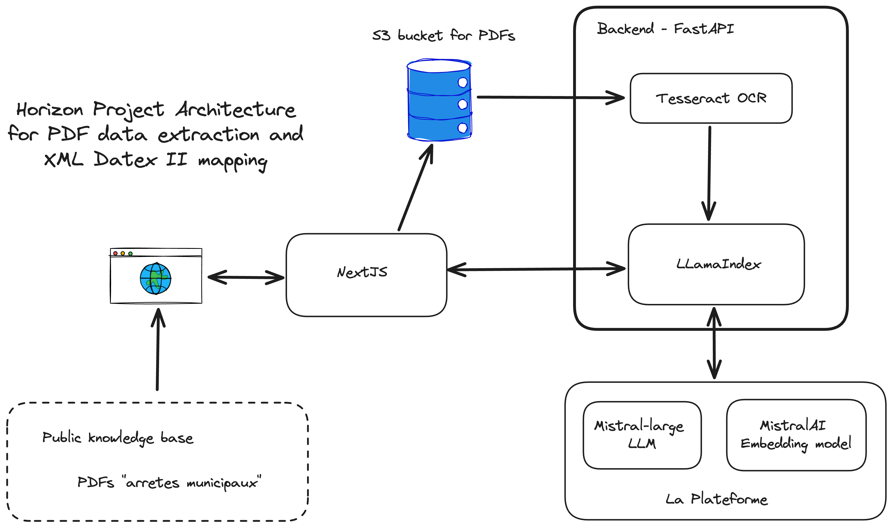

# Paris Mistral Hackathon
Dassault Outscale - Aleia Track

Our team's name was Horizon and we were composed of 3 members: Batu, Victor and Thomas.

## The problem

The goal of this hackathon was to answer the following problem:
"Exploit information from bylaws and dated road or parking space closure events for private individuals and businesses with Al-driven agents".

### Mandatory criteria

• Access to PDF files and images: to open PDF documents and insert information into the Dialog data model

• Open Data environment: free access to all data (1,000 municipal bylaws)

### Assessment criteria

• Data verification: is the solution able to identify the number of true data retrieved (recall & accuracy)?

• Geolocation: is the solution able to geolocate events using IGN APIs ?

• Added value: what benefits does the solution bring to its target?

### Deliverables

• Full Al agent code produced using MistralAl solution

• Working prototype demonstrating how an Al agent solution operates in real-time

• 5-minute oral presentation explaining the role of the Al agent, how it works and its impact in a real-world application.

## Our solution

Our solution is composed of:
- A TypeScript NextJS frontend that allows users to upload PDF files, containing bylaws (that could be images of digitized documents), to a S3 bucket
- A Python FastAPI backend that processes the PDF files and extracts the relevant information using [Tesseract OCR model](https://github.com/tesseract-ocr/tesseract)...
- ... and then send the extracted text to the [mistral-large LLM](https://docs.mistral.ai/api/#operation/createChatCompletion) on Mistral's La Platforme to map the text to the wanted XML Datex II format.
- Along the way we process the embeddings of the extracted OCR text, the XML template and the final result. We use these embeddings to calculate the [cosine similarity](https://en.wikipedia.org/wiki/Cosine_similarity) between the extracted text and the XML template. This allows us to give a score to quantify the quality of the extraction, and was an attempt to measure [Precision and Recall](https://en.wikipedia.org/wiki/Precision_and_recall).

We used this [XML Datex II](https://datex2.eu/) format because it is required in order to be used in the French state public platform [DiaLog](https://dialog.beta.gouv.fr/services-numeriques).

## Test cases

We tested our solution with [those test cases](https://drive.google.com/file/d/18ziqae71Jgafd_HlUXvD1Fx8tLYm_k5K/view?usp=sharing).

## How to run

Create a `.env` file in the root of the project by copying the content of the `dev.env` file and using your own Mistral API key.

Then run `docker compose up -d --build`
